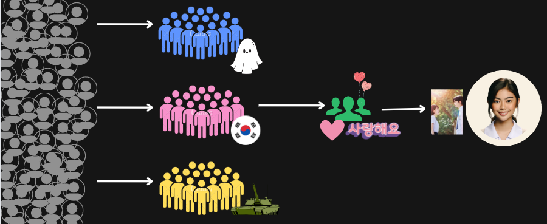
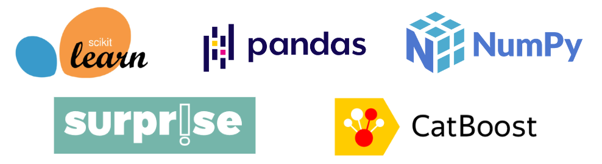

## Overview

This project develops a fast and accurate movie recommender system using a hybrid ML approach. The data was obtained from IMDb. The steps of this pipeline are:

- Train, Validation, and Test Split
- Cluster users in the train set based on their normalized frequency to review certain movie categories (which is obtained via CLARA categorical clustering)
- On each user cluster, train several predictive models and obtain predicted ratings on the validation set
- Using the predicted ratings of each model as features, train an ML model (CatBoost) on the validation set
- Obtain test predictions by identifying the user's cluster, retrieving the corresponding model, and predicting the user's movie rating
- Evaluate

This system achieved a test MAE of 1.68 on a 10-point scale, and an NDCG of 0.96.

## Core Packages Used

## Citation

IMDB Movie Dataset: All movies by genre. (2023, March 16). Kaggle. https://www.kaggle.com/datasets/rajugc/imdb-movies-dataset-based-on-genre

IMDB Movies Dataset. (2022, August 24). Kaggle. https://www.kaggle.com/datasets/ashishjangra27/imdb-movies-dataset
